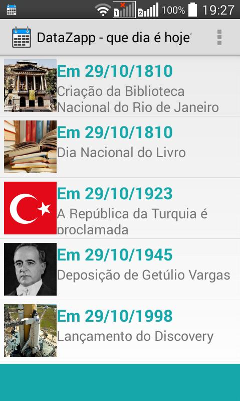
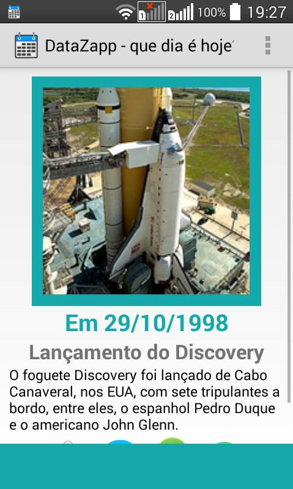
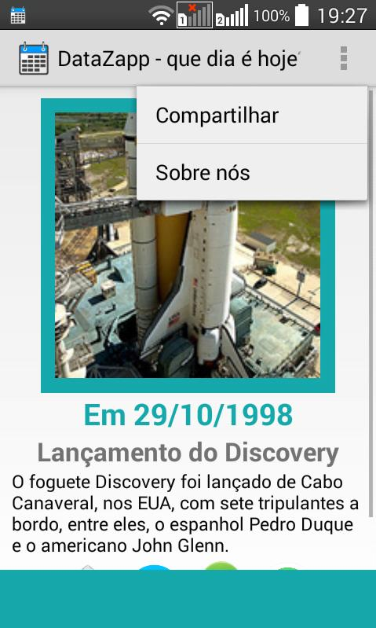

# public-DataZapp-app-android
 
PROJETO ANDROID (Arquivos e Códigos):

Status: Descontinuado;

Ano de publicação: 2015;

Android: 2.2+;

Última versão: 1.3;

Identificação: csilva.analisedeti.quediaehoje;

Link de acesso: https://apkpure.com/datazapp-que-dia-%C3%A9-hoje/csilva.analisedeti.quediaehoje;

Descrição:

Esteja completamente antenado aos momentos históricos e datas comemorativas do dia

Obtenha informação de comemorações importantes e datas históricas diariamente, e com muita facilidade.

Com uma interface simples e objetiva, saiba que o aconteceu e comemora-se na data de hoje, em todos os dias do ano.

Recursos:

Visualização de fácil utilização com imagens que representam cada data;
Tela de descrição de cada data comemorativa ou momento histórico importante;
Compartilhar aplicativo;
Compartilhar data comemorativa;
Notificação automática com novidades (uma vez ao dia);

